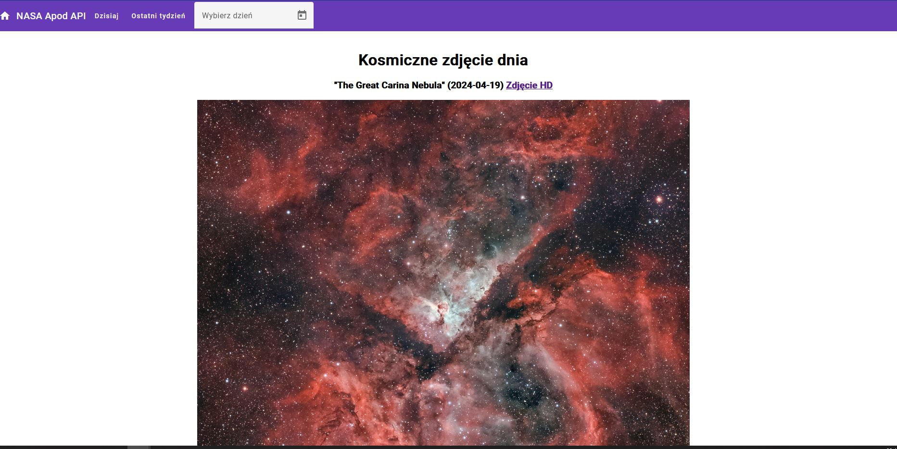

# Nasa Apod

Aplikacja APOD (Astronomy Picture of the Day) to projekt Angularowy, który wykorzystuje API NASA do prezentacji codziennego obrazu kosmosu wraz z krótkim opisem. Użytkownik może przeglądać obrazy z tygodnia, a także wybrać datę, aby zobaczyć zdjęcie z konkretnego dnia. Projekt korzysta z Angular Material do tworzenia nowoczesnego i responsywnego interfejsu użytkownika.

## Projekt zaliczeniowy

Rafał M. 14798

## Cechy

- wyświetlanie Dziennego Obrazu Kosmosu: każdego dnia prezentowane jest nowe zdjęcie wraz z opisem dostarczonym przez NASA
- przeglądanie Obrazów Tygodnia: użytkownicy mogą przeglądać obrazy z ostatnich siedmiu dni
- wybór Daty: możliwość wyboru dowolnej daty, aby zobaczyć obraz z tego dnia
- aby pobrac dane z API należy umieścić swój klucz w zmiennej environments/environment.ts environment.nasaApiKey

## Przykłady użycia po zbudowaniu i uruchomieniu projektu

Strona startowa - apod - Kosmiczne zdjęcie dnia

## Nasa

This project was generated with [Angular CLI](https://github.com/angular/angular-cli) version 17.3.5.

## Development server

Run `ng serve` for a dev server. Navigate to `http://localhost:4200/`. The application will automatically reload if you change any of the source files.

## Code scaffolding

Run `ng generate component component-name` to generate a new component. You can also use `ng generate directive|pipe|service|class|guard|interface|enum|module`.

## Build

Run `ng build` to build the project. The build artifacts will be stored in the `dist/` directory.

## Running unit tests

Run `ng test` to execute the unit tests via [Karma](https://karma-runner.github.io).

## Running end-to-end tests

Run `ng e2e` to execute the end-to-end tests via a platform of your choice. To use this command, you need to first add a package that implements end-to-end testing capabilities.

## Further help

To get more help on the Angular CLI use `ng help` or go check out the [Angular CLI Overview and Command Reference](https://angular.io/cli) page.
